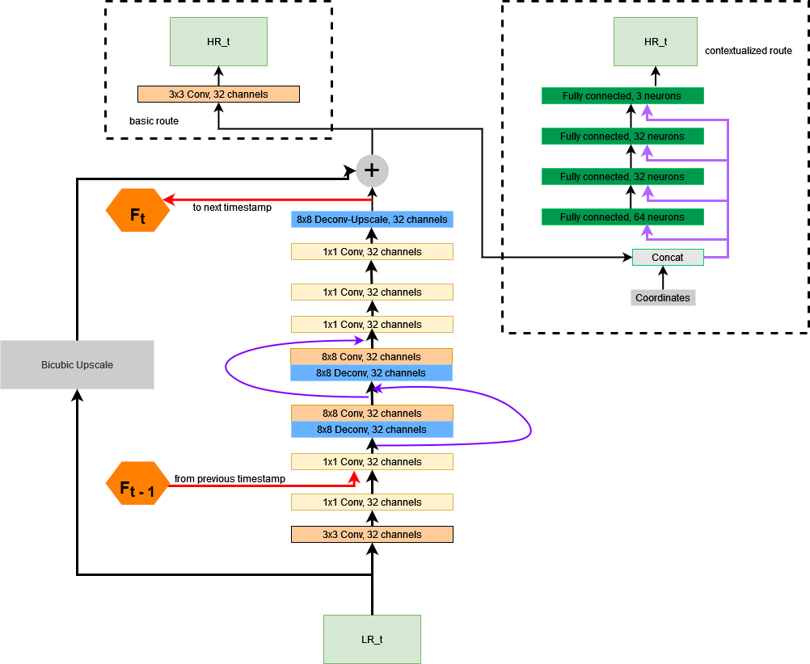
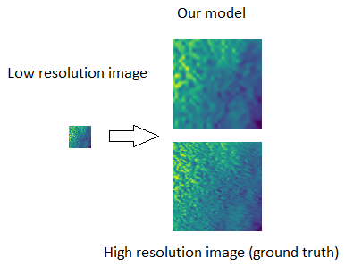

# Project: Physics Informed Multi-frame Super Resolution for Weather Forecasts

by Tulchinskiy Eduard, PhD-1 student


## Introduction

The weather forecasts are typically made by costly numerical models and the computational costs scale in such a way that 4x resolution increase requires 10x more resources. We are provided with a calculated dataset of weather forecasts for a region made by a WRF model in two resoutions. Task of our work is to improve a low resolution forecast with the help of multi-frame super resolution methods with physics informed parts.

First of all, meteorological data is very different from images, thus models must be trained from the scratch which requires a lot of data. And obtaining data in our domain is costly. Although they learn \textit{some} underlying relationships exist in the data, sometimes those relationships are \textit{not} the underlying physical principles that models are supposed to learn. Moreover, as it was shown in \cite{poorgen}, there are no guarantee of good ability to `generalization' (i.e. to work outside of the scenarios covered in training data).

Similar issues are arising in many different fields and to overcome them methods of Physics-Informed machine learning were introduced. These are numerous different techniques dedicated at incorporating into neural model knowledge about underlying physical laws by specially designed architecture or training procedure of a model. They have shown good results for many tasks. 

Many attempts were made for weather super resolution but they mostly were intended for super resolution by a single frame. So a question remains --- can the knowledge of development of atmospheric situation (data from several time-points) help us improve quality of prediction.

And thus, we aimed this project at creating a physics-informed neural model for multi-frame super resolution of weather forecast data.

## Implemented methods of Physicd-Informed Machine learning:

1) Gradient loss --- we penalize discrepancy in graidents of predected and targeted vector fields.

$$\mathcal{L}_{grad} = ||\mathbf{v} - \mathbf{w}||_1 +  || \nabla \mathbf{v} -  \nabla \mathbf{w}||_1$$

2) `Position contextualizing' --- we encode position of each measurement to help network overcome shortcomings of cnn.

## Model architecture



## Example of upscaling with our model



## Results
```latex
\scriptsize
\centering

\begin{tabular}{p{0.1\textwidth}| p{0.07\textwidth}p{0.07\textwidth}p{0.1\textwidth}} 
\toprule

\textbf{Model} & \textbf{MSE} & \textbf{MAE} & \textbf{PSNR} \\

\midrule

\multicolumn{4}{c}{\textbf{Baselines}} \\ 
\midrule
Bicubic & 7.2e-3  &  0.0604 & 22.404 \\
SR-CNN & 3.8e-3 & 0.0438 & 25.605 \\
ESRGAN & 5.6e-3 & 0.0533 & 23.795 \\
SRFBN & 3.8e-3 & 0.0428 & 25.820 \\
\midrule
\multicolumn{4}{c}{\textbf{Single frame model setups }} \\ 
\midrule
Gradient loss & 3.7e-3 & 0.0426  &  25.838 \\
Contextualized & 3.7e-3 & 0.0427 & 25.854 \\
Both & 3.6e-3 & 0.0421 & 25.912  \\
\midrule
\multicolumn{4}{c}{\textbf{Multiframe setup}} \\
\midrule
Final & 3.1e-3 & 0.0396 & 26.113  \\
\bottomrule
\end{tabular}
\caption{Performance of models on Test data. \textbf{MSE}=mean square error. \textbf{MAE}=mean absolute error. \textbf{PSNR}=average peak signal to noise ratio. }

'''

## Conclusion

In this research we explored the effect of physics-informed methods on super-resolutioning weather data (on the example of wind power data). We created deep convolutional multi-frame model for upscaling data and included two physics-informed methods --- contextualization and gradient loss into it. 

We trained our model in different setups and compared it against baselines in image super resolutioning. From the results that we achieved on our data we can not say that including `physical knoweledge' into model helps improve its performance.

Small impact of including physics-informed methods may be caused by small size of dataset or small size of images. 

An important challenge for us was to extract correct physical data from PNG-files  and problems with initial dataset arised likely due to improper conversion (float-point numbers are converted to 3 single-byte integers w.r.t. some formula and super resolutioning over them as over 3 channels of standard RGB-image may be unjust).

We are planning to continue this research, did more research into the subject, use different data and explore more physics-informed approaches.

## Data source
[Data used in the project
](https://drive.google.com/file/d/1d566eJK2pmq3oCyuI7IlVBg7ZxIpDwC-/view?usp=sharing)
See `datasets' subfolder for more information
we consider uploading data into this repository if it will be really needed (they are quite large).


### Instruction: 

1) clone this repository via
```shell
git clone https://github.com/ArGintum/featherweather.git
```

2) Upload data into ```datasets''' subfolder and unzip
3) Use IPython notebook ```Baselines.ipynd''' to get accustomed with quality metrics of baselines
4) Unzip baselines predictions if needed
5) Use IPython notebook ```Mainmodels.ipynd''' to get accustomed with our model and its training and evaluating
6) File ```models.py''' contains source code of different setups of our model, some baselines and custom loss functions
7) File ```model_eval.py''' containts source code for scoring procedures of our models
8) File ```utils.py''' contains source code of auxillary functions.
